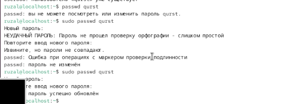
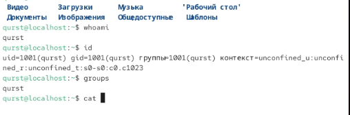
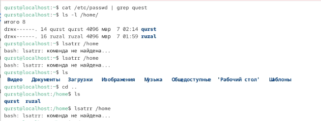
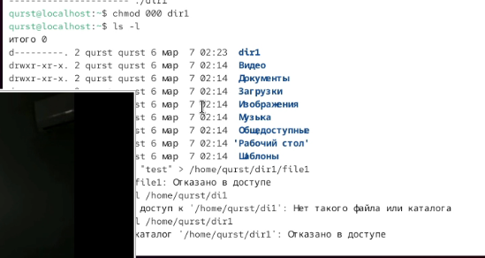

---
## Author
author:
  name: Гаязов Рузаль Ильшатович 
  degrees: Stuent
  orcid: 0000-0002-0877-7063
  email: 1132247524
  affiliation:
    - name: Российский университет дружбы народов
      country: Российская Федерация
      postal-code: 117198
      city: Москва
      address: ул. Миклухо-Маклая, д. 6
## Title
title: Структура научной презентации
subtitle: Простейший вариант
license: CC BY
date: today
date-format: "YYYY-MM-DD" # Example: 2025-09-06
---

# Информация

## Докладчик

:::::::::::::: {.columns align=center}
::: {.column width="70%"}

  * Гаязов Рузаль
  * Студент
  * профессор кафедры теории вероятностей и кибербезопасности
  * Российский университет дружбы народов им. П. Лумумбы

:::
::: {.column width="30%"}

:::
::::::::::::::

# Вводная часть

## Актуальность

- Важно донести результаты своих исследований до окружающих
- Научная презентация --- рабочий инструмент исследователя
- Необходимо создавать презентацию быстро
- Желательна минимизация усилий для создания презентации

## Объект и предмет исследования

- Презентация как текст
- Программное обеспечение для создания презентаций
- Входные и выходные форматы презентаций

## Цели и задачи

Получение практических навыков работы в консоли с атрибутами файлов, закрепление теоретических основ дискреционного разграничения доступа в современных системах с открытым кодом на базе ОС Linux.

# 1. Создаем гостевую учетную запись и задаем ей пароль через командую строку.

## 

# 2. Вводим команды из лабораторной работы

## 

# 3. Заходим в гостевую запись и проверяем базовые параметры

## 

# 4. Вводим команды из лабораторной работы

## 

# 5. Вводим команды из лабораторной работы

## 

# 6. Вводим команды из лабораторной работы

## 

# 7. Вводим команды из лабораторной работы

## 

# 8. Вводим команды из лабораторной работы

## 

# 9. Создаем папку и проверяем доступ к ней

## 

## Вывод 

Я получил практические навыки работы с атрибутами файлов.

