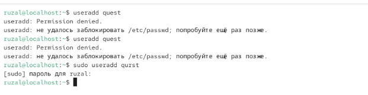
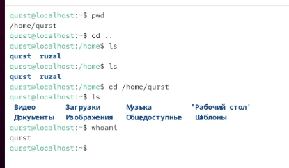
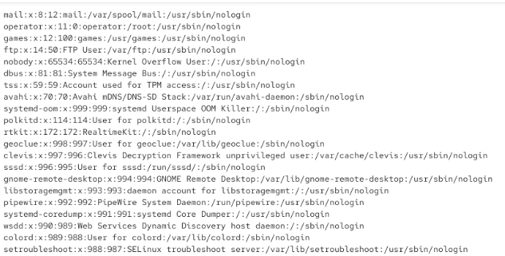
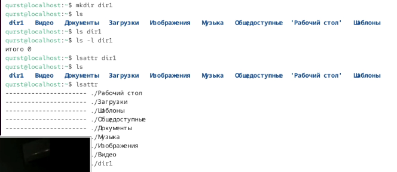
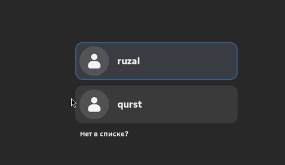

---
## Author
author:
  name: Гаязов Рузаль Ильшатович
  degrees: Student
  orcid: 0000-0002-0877-7063
  email: 1132247524
  affiliation:
    - name: Российский университет дружбы народов
      country: Российская Федерация
      postal-code: 117198
      city: Москва
      address: ул. Миклухо-Маклая, д. 6

## Title
title: "Отчёт лабораторная работа №2"
subtitle: "Простейший вариант"
license: "CC BY"
---

# Цель работы

Получение практических навыков работы в консоли с атрибутами файлов, закрепление теоретических основ дискреционного разграничения доступа в современных системах с открытым кодом на базе ОС Linux.

# Выполнение лабораторной работы

1. Создаем гостевую учетную запись и задаем ей пароль через командую строку.

2. Вводим команды из лабораторной работы

3. Заходим в гостевую запись и проверяем базовые параметры

4. Вводим команды из лабораторной работы

5. Вводим команды из лабораторной работы

6. Вводим команды из лабораторной работы

7. Вводим команды из лабораторной работы

8. Вводим команды из лабораторной работы

9. Создаем папку и проверяем доступ к ней

# Выводы

Я получил практические навыки работы с атрибутами файлов.
