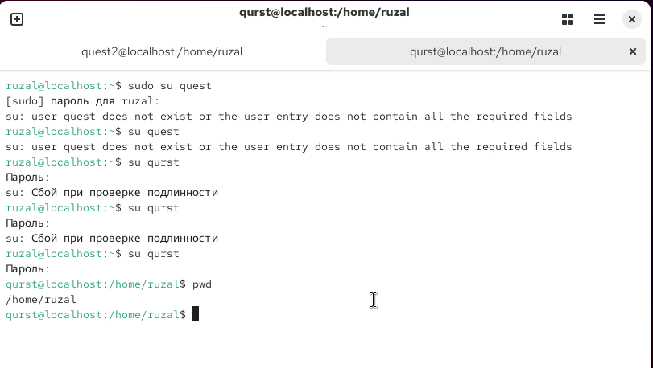
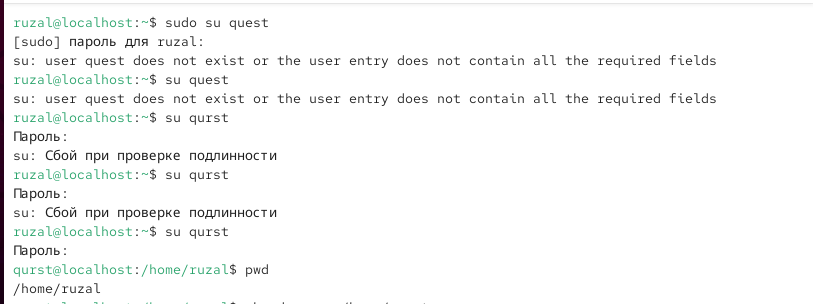

---
## Author
author:
  name: Гаязов Рузаль Ильшатович
  degrees: Student
  orcid: 0000-0002-0877-7063
  email: 1132247524
  affiliation:
    - name: Российский университет дружбы народов
      country: Российская Федерация
      postal-code: 117198
      city: Москва
      address: ул. Миклухо-Маклая, д. 6

## Title
title: "Отчёт лабораторная работа №2"
subtitle: "Простейший вариант"
license: "CC BY"
---

# Цель работы

Получение практических навыков работы в консоли с атрибутами файлов для групп пользователей.

# Выполнение лабораторной работы

1. Создаем гостевую вторую учетную запись и задаем ей пароль через командую строку.

2. Вводим команды из лабораторной работы

3. Вводим команды из лабораторной работы

4. Вводим команды из лабораторной работы

5. Вводим команды из лабораторной работы

6. Вводим команды из лабораторной работы

# Выводы

Я получил практические навыкы работы в консоли с атрибутами файлов для групп пользователей.
