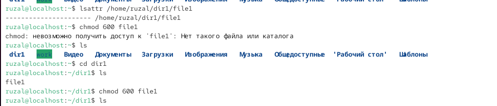
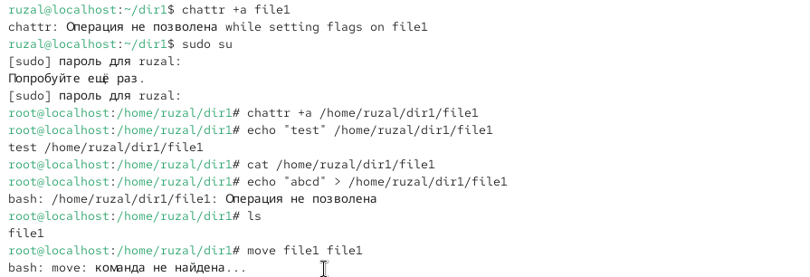
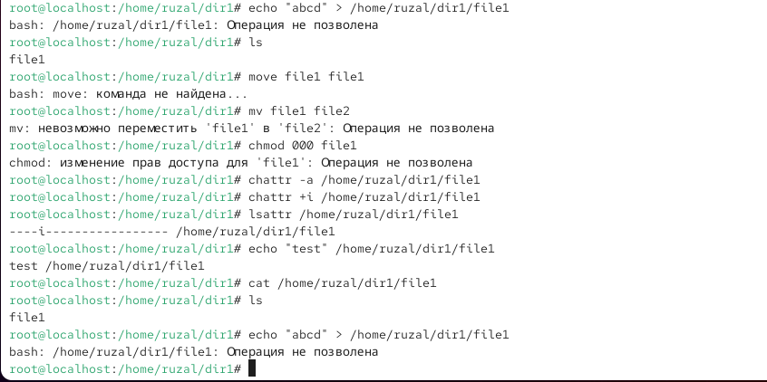

---
## Author
author:
  name: Гаязов Рузаль Ильшатович 
  degrees: Stuent
  orcid: 0000-0002-0877-7063
  email: 1132247524
  affiliation:
    - name: Российский университет дружбы народов
      country: Российская Федерация
      postal-code: 117198
      city: Москва
      address: ул. Миклухо-Маклая, д. 6
## Title
title: Структура научной презентации
subtitle: Простейший вариант
license: CC BY
date: today
date-format: "YYYY-MM-DD" # Example: 2025-09-06
---

# Информация

## Докладчик

:::::::::::::: {.columns align=center}
::: {.column width="70%"}

  * Гаязов Рузаль
  * Студент
  * Российский университет дружбы народов им. П. Лумумбы

:::
::: {.column width="30%"}

:::
::::::::::::::

## Цель

Получение практических навыков работы в консоли с расширенными атрибутами файлов.

# 1. От имени пользователя guest определил расширенные атрибуты файла.

## 

# 2. Вводим команды из лабораторной работы

## 

# 3. Вводим команды из лабораторной работы

## 

## Вывод 

В результате выполнения работы я повысил свои навыки использования интерфейса командой строки (CLI), познакомился на примерах с тем, как используются основные и расширенные атрибуты при разграничении доступа. Имел возможность связать теорию дискреционного разделения доступа (дискреционная политика безопасности) с её реализацией на практике в ОС Linux. Опробовал действие на практике расширенных атрибутов «а» и «i».
