---
## Author
author:
  name: Гаязов Рузаль Ильшатович 
  degrees: Stuent
  orcid: 0000-0002-0877-7063
  email: 1132247524
  affiliation:
    - name: Российский университет дружбы народов
      country: Российская Федерация
      postal-code: 117198
      city: Москва
      address: ул. Миклухо-Маклая, д. 6
## Title
title: Структура научной презентации
subtitle: Простейший вариант
license: CC BY
date: today
date-format: "YYYY-MM-DD" # Example: 2025-09-06
---

# Информация

## Докладчик

:::::::::::::: {.columns align=center}
::: {.column width="70%"}

  * Гаязов Рузаль
  * Студент
  * Российский университет дружбы народов им. П. Лумумбы

:::
::: {.column width="30%"}

:::
::::::::::::::

## Цель

Изучение механизмов изменения идентификаторов, применения
SetUID- и Sticky-битов. Получение практических навыков работы в консоли с дополнительными атрибутами. Рассмотрение работы механизма
смены идентификатора процессов пользователей, а также влияние бита
Sticky на запись и удаление файлов.

# 1. Создаю программу simpleid.c:

## 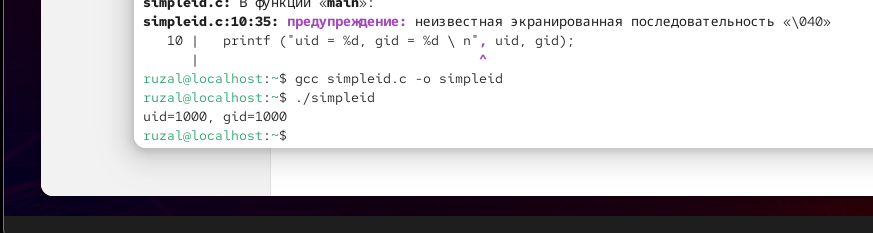

# 2. Вводим команды из лабораторной работы

## 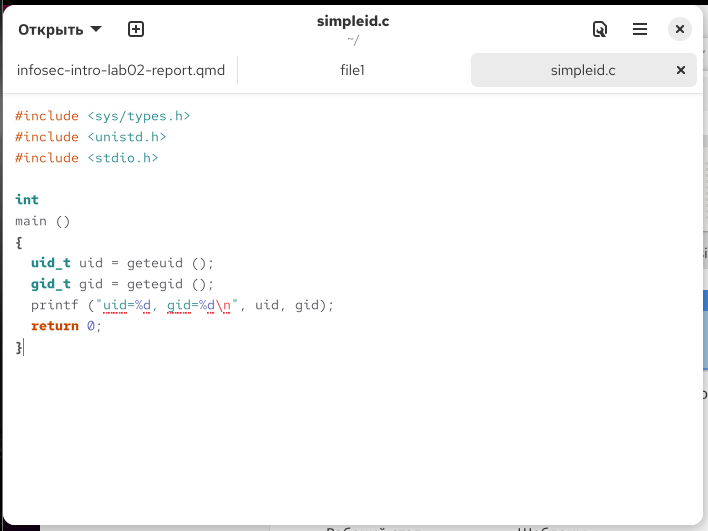

# 3. Вводим команды из лабораторной работы

## 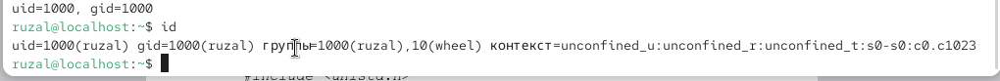

# 4. Вводим команды из лабораторной работы

## 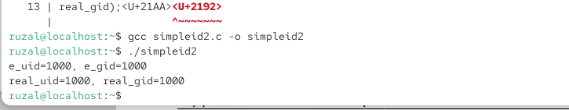

# 5. Вводим команды из лабораторной работы

## 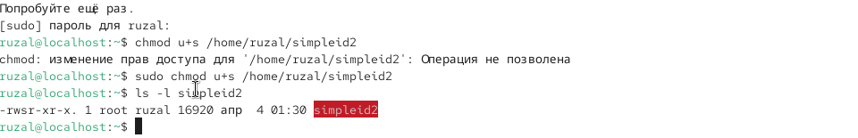

# 6. Вводим команды из лабораторной работы

## 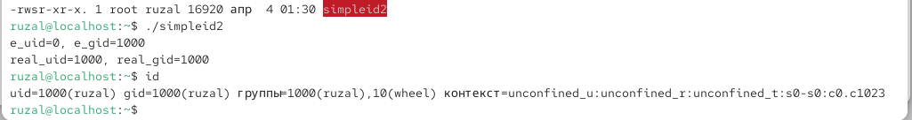

# 7. Вводим команды из лабораторной работы

## 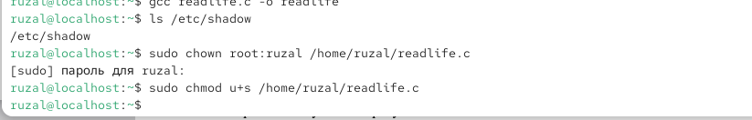

# 8. Вводим команды из лабораторной работы

## 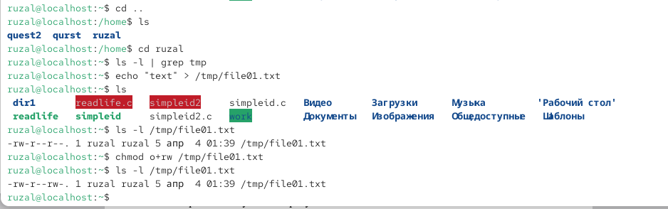

# 9. Вводим команды из лабораторной работы

## 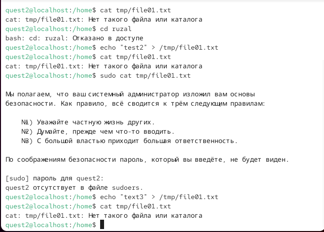

# 10. Вводим команды из лабораторной работы

## 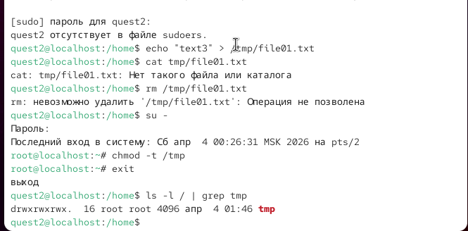

# 11. Вводим команды из лабораторной работы

## 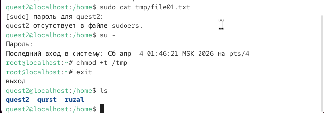

## Вывод 

В результате выполнения работы я изучил механизмы изменения идентификаторов, применения
SetUID- и Sticky-битов. Получил практические навыки работы в консоли с дополнительными атрибутами. Рассмотрел работы механизма
смены идентификатора процессов пользователей, а также влияние бита
Sticky на запись и удаление файлов.
